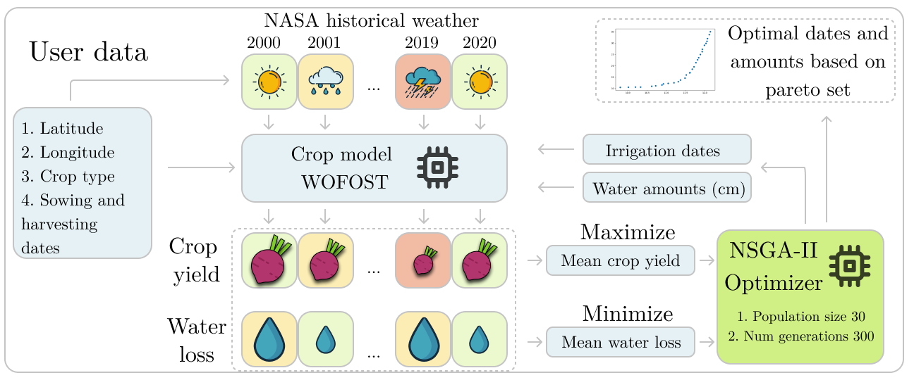

# Multi-objective irrigation optimization
> Multi-objective approach to optimize irrigation using a crop simulation model and historical weather data.

[](https://github.com/EDSEL-skoltech/multi_objective_irrigation/blob/main/LICENSE)
[](https://github.com/EDSEL-skoltech/multi_objective_irrigation/issues)
[](https://github.com/EDSEL-skoltech/multi_objective_irrigation/stargazers)
[](https://www.researchgate.net/project/Digital-Agro)


We propose a machine learning approach based on the crop simulation model WOFOST to assess the crop yield and water use efficiency. In our work, we use historical weather to evaluate extreme weather scenarios. The application of multi-criteria optimization based on the non-dominated sorting genetic algorithm-II (NSGA-II) allows users to find the dates and volume of water for irrigation, maximizing the yield and reducing the water loss.



-------

## Optimization process


## Google Colab 

How to run example of WOFOST model and multi-objective irrigation optimization code? 

Open `How_to_start.ipynb` in Google Colab!

<a href="https://colab.research.google.com/github/EDSEL-skoltech/multi_objective_irrigation/blob/main/How_to_start.ipynb" target="_parent"></a>

To plot results of optimization open `Plots_for_ICCS.ipynb`

<a href="https://colab.research.google.com/github/EDSEL-skoltech/multi_objective_irrigation/blob/main/Plots_for_ICCS.ipynb" target="_parent"></a>


## Dependencies 

PCSE/WOFOST - Python Crop Simulator Environment

https://pcse.readthedocs.io/en/stable/

PyMOO - Multi-objective optimization

https://pymoo.org/


## Installation

Clone this repository and create new `conda env` on your local machine

`git clone https://github.com/EDSEL-skoltech/multi_objective_irrigation.git`

Create new env with `pcse` package for crop models WOFOST

`conda env create -f py3_pcse.yml`

`conda activate py3_pcse`

## Usage example

To run multi-objective optimization with example from Moscow region and potato crop run file

`./run_example.sh`

User can edit input file `--path_to_user_file` and other parameters
```
python3 multiobjective_optimizer.py --path_to_data_dir './util/input_data/' 

--path_to_user_file './util/input_data/malino_potato.json' 

--path_to_CSV_weather './data/meteo' 

--num_generation '5' --population_size '10' 

--path_to_npy_files './experiments/test/potato/'
```

User can write main information about agricultural management in JSON format

Example for Moscow region

Here we setup geo coordinates, 

Sowing date in format YYYY-MM-DD as "crop_start"

Harvesting date in format YYYY-MM-DD as "crop_end"

User can select crop among number of crops: [list of crops](https://github.com/ajwdewit/WOFOST_crop_parameters)

Irrigation dates and volumes (cm), date of fertilization and amounts on NPK (kg)

```
{"name": "Potato", 
    "latitude": 54.85, 
    "longitude": 38.85, 
    "crop_start": "2019-04-20", 
    "crop_end": "2019-09-15", 
    "crop_name": "potato", 
    "irrigation_events": ["2019-06-10", "2019-06-20", "2019-07-01", "2019-07-10", "2019-07-20","2019-07-29", "2019-08-15"], "irrigation_ammounts": [2, 2, 2, 2, 2, 2, 2], 
    "npk_events": ["2019-06-22"], 
    "npk": [[90,10,90]]
    }
```

## Meta

Mikhail Gasanov – Mikhail.Gasanov@skoltech.ru

## License

Distributed under the MIT license. See ``LICENSE`` for more information.


## TO-DO list

- [X] Weather loader from NASA-POWER
- [ ] Test how weather loader convert data to CSV
- [ ] Function to save optimal irrigation dates and volumes to txt file


## Contributing

1. Fork it (<https://github.com/EDSEL-skoltech/multi_objective_irrigation/fork>)
2. Create your feature branch (`git checkout -b feature/fooBar`)
3. Commit your changes (`git commit -am 'Add some fooBar'`)
4. Push to the branch (`git push origin feature/fooBar`)
5. Create a new Pull Request

